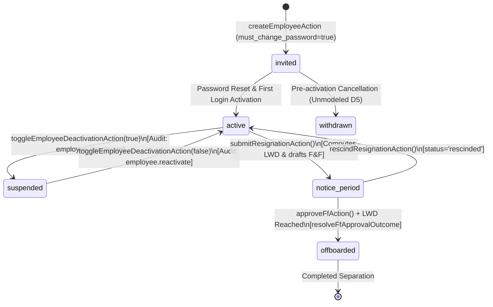

# HRMS v2.7 — Comprehensive Architecture & Domain Wayfinder Guide

## Executive Overview & System Boundary
HRMS v2.7 is an enterprise Human Resource Management System built on **Next.js 16 App Router**, **TypeScript**, **Tailwind CSS**, and **Supabase / PostgreSQL (RLS)**. It manages the complete end-to-end employee lifecycle, multi-template work calendars, attendance verification, leave ledgers, India statutory payroll processing, expense reimbursements, and full & final (F&F) offboarding settlements.

---

## 1. System Boundaries, Personas & RBAC Architecture

### The Three-Tier Authorization Pipeline
1. **Edge Middleware Gate ([`src/middleware.ts`](file:///C:/Users/HP/OneDrive/Desktop/Projects/Cursor/HRMS/src/middleware.ts))**:
   - Skips `/login`, `/403`, and public routes.
   - Attaches strict Content Security Policy (CSP) headers with per-request cryptographic nonces.
   - **Mock / E2E Mode**: Inspects HMAC-signed `sb-access-token` cookies against `E2E_MOCK_ALLOWED_ROUTES` in `src/lib/services/mock-rbac.ts`.
   - **Live Supabase Mode**: Queries `employee_roles` joined with `roles`. System Admin bypasses all checks; all other roles undergo batch DB RPC permission checks (`has_permission`).
2. **Permission Map & Cumulative Union ([`src/lib/auth/permissions-map.ts`](file:///C:/Users/HP/OneDrive/Desktop/Projects/Cursor/HRMS/src/lib/auth/permissions-map.ts))**:
   - `ROLE_PERMISSIONS_MAP`: Centralized source of truth defining permissions for 5 active roles: `employee`, `manager`, `hr`, `payroll_admin`, and `system_admin`. (3 dormant roles: `statutory_admin`, `finance_admin`, and `it_admin` are formally retired).
   - `permissionsForRoles(roles)`: Computes the deduplicated union of permissions for multi-role personas (e.g. `multi.hrmgr` = HR + Manager).
   - `hasPermission(permissions, code)`: Evaluates hierarchical scope fallback ($\text{Code} \leftarrow \text{Code.all} \leftarrow \text{Code.team} \leftarrow \text{Code.self}$).
3. **Client Role Context & Workspace Filtering ([`src/lib/roleContext.tsx`](file:///C:/Users/HP/OneDrive/Desktop/Projects/Cursor/HRMS/src/lib/roleContext.tsx))**:
   - Hydrates active roles via `getCurrentUserRolesAction()`.
   - Exposes `activeRolePermissions` allowing multi-role employees to switch focus without stripping underlying backend authorization.

### Segregation of Duties (SoD) Matrix
| Domain Capability | HR Admin (`hr`) | Payroll Admin (`payroll_admin`) | System Admin (`system_admin`) |
| :--- | :--- | :--- | :--- |
| **Employee Lifecycle** | Create, Edit, Import, Deactivate | Read-only (`employee.view.all`) | System Config & Technical Bypass |
| **Leave & Attendance** | Manage types, Override corrections, Approve HR leaves | Read-only (`attendance.view.all`, `leave.view.all`) | Technical Bypass |
| **Payroll Processing** | ❌ **Prohibited** (No `payroll.*` permissions) | Exclusive: `payroll.run`, `payroll.finalize`, `payroll.publish`, `payroll.reopen` | Technical Bypass |
| **Separation / F&F** | Create F&F, Manage clearances, Approve F&F | View only (`ff.view`) | Technical Bypass |

---

## 2. Employee Lifecycle & State Machine (FSM)

### Lifecycle Transition Rules
- **`invited` $\to$ `active`**: Created via Admin Onboarding ([`createEmployeeAction`](file:///C:/Users/HP/OneDrive/Desktop/Projects/Cursor/HRMS/src/lib/actions/employees.ts#L11)) or CSV Import. Requires `company_settings.is_configured = true`. Sets `must_change_password = true`; first login forces password reset.
- **`active` $\rightleftharpoons$ `suspended`**: Administrative review toggled via [`toggleEmployeeDeactivationAction`](file:///C:/Users/HP/OneDrive/Desktop/Projects/Cursor/HRMS/src/lib/actions/employees.ts#L190). Emits immutable audit log records. Route access is denied (`[]`), but payroll run eligibility is decoupled and governed by effective-dated `is_eligible` flags in `payroll_eligibility`.
- **`active` $\to$ `notice_period`**: Initiated via [`submitResignationAction`](file:///C:/Users/HP/OneDrive/Desktop/Projects/Cursor/HRMS/src/lib/actions/offboarding.ts#L8). Computes $\text{Last Working Day (LWD)} = \text{ResignationDate} + \text{NoticeDays}$. Inserts active row in `separation_records` and draft record in `ff_settlement_records`.
- **Resignation Rescission**: [`rescindResignationAction`](file:///C:/Users/HP/OneDrive/Desktop/Projects/Cursor/HRMS/src/lib/actions/offboarding.ts#L64) sets `separation_records.status = 'rescinded'`, restoring active standing and halting F&F progression.
- **`notice_period` $\to$ `offboarded`**: Multi-department clearances (IT, Finance, Admin, HR) tracked in `ff_clearances`. [`approveFfAction`](file:///C:/Users/HP/OneDrive/Desktop/Projects/Cursor/HRMS/src/lib/actions/offboarding.ts#L131) transitions status to `offboarded` **only if** $\text{LWD} \le \text{Today}$ (evaluated by [`resolveFfApprovalOutcome`](file:///C:/Users/HP/OneDrive/Desktop/Projects/Cursor/HRMS/src/lib/services/offboarding-engine.ts#L42)).

---

## 3. Multi-Layer Calendar & Attendance Engine

### Precedence Hierarchy (`is_working_day()`)
For any given date and employee, the system evaluates calendar layers in strict descending priority ([`schema/04_work_calendar.sql`](file:///C:/Users/HP/OneDrive/Desktop/Projects/Cursor/HRMS/schema/04_work_calendar.sql#L61)):
1. **Employment Boundary**: Dates prior to employee `date_of_joining` (DOJ) or after `last_working_day` (LWD) $\to$ `not_applicable` (`false`).
2. **Template Assignment**: Resolved via `employee_work_calendar_assignment` (GiST daterange no-overlap constraint), falling back to `DEFAULT_5DAY` (`{1,2,3,4,5}`).
3. **Compulsory Holiday (`compulsory_holiday`)**: Unconditional non-working day mapped to template (`is_optional = false`).
4. **Selected Optional Holiday (`selected_optional_holiday`)**: Floating holiday chosen by employee in `employee_optional_holiday_selections` (capped at max 2 selections per cycle).
5. **Weekly Off (`weekly_off`)**: Day of week matching non-working days or alternate Saturday rules in `work_calendar_templates`.
6. **Standard Working Day (`working_day`)**: Standard payable working day.

### Punch Calculation & Anomaly Lifecycle
- **Punch Durations ([`schema/05_attendance.sql`](file:///C:/Users/HP/OneDrive/Desktop/Projects/Cursor/HRMS/schema/05_attendance.sql#L72))**:
  - $\ge 480\text{ min (8 hrs)} \implies \text{'present'}$
  - $\ge 240\text{ min (4 hrs)} \implies \text{'half\_day'}$
  - Missing punch or $< 240\text{ min} \implies \text{'pending\_review'}$ (Anomaly)
  - Work on non-working day $\implies \text{'extra\_work'}$ (Qualifies for Comp-Off Grant)
- **Cut-Off & Loss of Pay (LOP)** ([`src/lib/services/payroll-engine.ts`](file:///C:/Users/HP/OneDrive/Desktop/Projects/Cursor/HRMS/src/lib/services/payroll-engine.ts#L10)):
  $$\text{payableUnits} = \min(\text{DaysInMonth}, \text{WorkedDays} + \text{PaidLeaveDays})$$
  $$\text{lopUnits} = \max(0, \text{DaysInMonth} - \text{PayableUnits})$$
  At month-end payroll cut-off, unresolved anomalies default to Loss of Pay (LOP) for the active cycle.
- **Retroactive Arrears**: Approving an attendance correction post-cut-off creates a row in `payroll_adjustments` (`adjustment_type: 'arrears'`), automatically reimbursed in the following payroll cycle.

---

## 4. Leave Policy, Balances & Privacy Layer

### Derived `on_leave` View (`v_employee_on_leave`)
`on_leave` is a read-only SQL view generated by cross-joining approved `leave_requests` across `generate_series(start_date, end_date, '1 day')`. It dynamically overlays on the calendar without mutating physical attendance records.

### Sandwich Rule Calculation (`calculate_leave_days`)
- **Sandwich Disabled (`is_sandwich_enabled = false`)**: Only standard working days consume leave quota. Intervening weekends and compulsory holidays are not deducted.
- **Sandwich Enabled (`is_sandwich_enabled = true`)**: Every calendar day in the range consumes leave balance, converting enclosed non-working days into deducted leave units.
- **Half-Day**: Single-day first-half or second-half leaves return $0.5$ days directly.

### Two-Phase Ledger State Machine ([`schema/06_leave.sql`](file:///C:/Users/HP/OneDrive/Desktop/Projects/Cursor/HRMS/schema/06_leave.sql#L164))
1. **Reservation on Submission**: `trg_process_leave_reservation` increments `leave_allocations.pending_days` and records a `'reservation'` entry in `leave_ledger`, preventing quota double-spending while approval is pending.
2. **Usage on Approval**: Converts `pending_days` $\to$ `used_days` and logs a `'usage'` transaction in `leave_ledger`.

### Privacy Masking (FR §4.7 - `v_leave_requests_masked`)
Medical privacy is protected at the SQL view level for Maternity and Paternity leave types:
- **Applying Employee**: Sees full details.
- **HR Admin (`leave.approve.hr`)**: Sees full details for compliance verification.
- **Reporting Managers & Peers**: The leave type name is masked to **`"Parental Leave"`** and the application reason is redacted to **`"[Redacted]"`**.

### Comp-Off Validity & Forfeiture ([`schema/17_scheduled_jobs.sql`](file:///C:/Users/HP/OneDrive/Desktop/Projects/Cursor/HRMS/schema/17_scheduled_jobs.sql#L56))
- Comp-off grants are generated from verified `extra_work` events with $\text{expiry\_date} = \text{worked\_date} + 90\text{ days}$.
- Automated cron job `job_expire_comp_off_grants()` scans daily, marking expired grants as `status = 'rejected'` and posting a debit transaction `'comp_off_expiry'` to the leave ledger.

---

## 5. India Statutory Payroll & Calculation Engine

### CTC & Basic Salary Decomposition ([`src/lib/services/compensation-engine.ts`](file:///C:/Users/HP/OneDrive/Desktop/Projects/Cursor/HRMS/src/lib/services/compensation-engine.ts))
- $\text{Monthly Gross} = \text{round}(\text{Annual CTC} / 12)$
- $\text{Basic Monthly} = \text{round}(\text{Monthly Gross} \times 0.50)$
- $\text{Leave Encashment Daily Rate} = \text{Basic Monthly} / 26$ (26-day statutory divisor).

### Statutory Deduction Formulas ([`src/lib/services/statutory-engine.ts`](file:///C:/Users/HP/OneDrive/Desktop/Projects/Cursor/HRMS/src/lib/services/statutory-engine.ts))
1. **Employees' Provident Fund (EPF)**:
   - $\text{PF Wage} = \min(\text{Basic Monthly}, ₹15,000)$
   - $\text{Employee PF} = \text{round}(\text{PF Wage} \times 12\%) \quad | \quad \text{Employer PF} = \text{round}(\text{PF Wage} \times 12\%)$
2. **Employees' State Insurance (ESI)**:
   - Applicable **only if** $\text{Gross Monthly} \le ₹21,000$.
   - $\text{Employee ESI} = \lceil \text{Gross Monthly} \times 0.75\% \rceil \quad | \quad \text{Employer ESI} = \lceil \text{Gross Monthly} \times 3.25\% \rceil$
3. **Professional Tax (PT)**:
   - Evaluated against state-specific income brackets (e.g. Karnataka: ₹0 below ₹25k gross, ₹200 above ₹25k gross).
   - Enforces an annual statutory limit of ₹2,500 via $\min(\text{ptAmount}, \max(0, 2500 - \text{ytdPtDeducted}))$.
4. **Labour Welfare Fund (LWF)**:
   - Fixed state monthly deductions (MH/GJ: ₹12, KA/TN/AP/KL: ₹20, WB: ₹15).
5. **Income Tax TDS (FY 2025-26)**:
   - **New Tax Regime**: ₹75,000 standard deduction; full Section 87A rebate for taxable income $\le ₹12,00,000$ (₹0 tax); progressive slabs ($15\%$ to $30\%$) with marginal relief and high-earner surcharges + mandatory $4\%$ Health & Education Cess.
   - **Old Tax Regime**: ₹50,000 standard deduction + Section 80C (up to ₹1.5L) + Section 80D + progressive slabs + $4\%$ Cess.

### Pre-Flight Payroll Locks & Stale F&F Invalidation ([`schema/09_payroll.sql`](file:///C:/Users/HP/OneDrive/Desktop/Projects/Cursor/HRMS/schema/09_payroll.sql), [`schema/13_ff_settlement.sql`](file:///C:/Users/HP/OneDrive/Desktop/Projects/Cursor/HRMS/schema/13_ff_settlement.sql))
- **Pre-Flight Lock (`validate_payroll_lock`)**: Finalization is blocked if:
  1. Unresolved `pending_review` attendance records exist in the period.
  2. Pending unapproved leave requests overlap the period.
  3. Active employees are missing effective statutory profiles.
- **Stale F&F Invalidation**: Triggers `trg_invalidate_ff_leave` and `trg_invalidate_ff_attendance` automatically set `is_stale = true` on draft settlements if leave or attendance records mutate prior to clearance approval.

---

## 6. Expense Reimbursements & Cross-Role Golden Paths

### Two-Stage Expense State Machine ([`src/lib/actions/approvals.ts`](file:///C:/Users/HP/OneDrive/Desktop/Projects/Cursor/HRMS/src/lib/actions/approvals.ts#L180))
For reimbursement categories configured with `approval_route = 'manager_then_hr'`:
1. **Submission**: [`submitReimbursementClaimAction`](file:///C:/Users/HP/OneDrive/Desktop/Projects/Cursor/HRMS/src/lib/actions/reimbursements.ts#L8) assigns `initialStatus = 'pending_manager'`.
2. **Manager Approval (Stage 1)**: [`decideApprovalAction`](file:///C:/Users/HP/OneDrive/Desktop/Projects/Cursor/HRMS/src/lib/actions/approvals.ts#L78) intercepts manager approval and transitions claim to `pending_hr`.
3. **HR Approval (Stage 2)**: HR Admin approves claim $\to \text{'approved'}$.
4. **Payroll Disbursement**: Picked up as a payment item in `payroll_payment_items` (`reimbursement_taxable` or `reimbursement_non_taxable` based on category taxability flag).

### Core Cross-Role Interaction Matrix (C1–C15) ([`docs/FLOW_MATRIX.md`](file:///C:/Users/HP/OneDrive/Desktop/Projects/Cursor/HRMS/docs/FLOW_MATRIX.md))
- **C1 (Leave)**: Employee $\to$ Manager (`leave_ledger` reservation $\to$ usage).
- **C2 (Attendance)**: Employee $\to$ Manager (`pending_review` $\to$ `present`).
- **C3 (Permission)**: Employee $\to$ Manager ($\le 120$ min pass).
- **C4 (Expense Two-Stage)**: Employee $\to$ Manager $\to$ HR $\to$ Payroll disbursement.
- **C5 (Expense Direct)**: Employee $\to$ HR (`hr_only` route).
- **C6 (Encashment)**: Employee $\to$ HR $\to$ Payroll (26-day divisor).
- **C7 (HR Self-Leave)**: HR $\to$ HR Alternate Approver (`company_settings.alternate_hr_approver_id`).
- **C8 (HR Leave Fallback)**: HR $\to$ System Admin (fallback when no alternate approver designated).
- **C9 (Separation)**: Employee/Manager $\to$ HR (`ff_clearances` coordination).
- **C10 (Full Chain)**: Employee $\to$ Manager $\to$ HR $\to$ Payroll Admin (Hire-to-Payslip).
- **C11 (Cut-off Handoff)**: HR $\to$ Payroll Admin (Pre-flight validation lock).
- **C12 (Payslip Delivery)**: Payroll Admin $\to$ Employee (`is_published: true`).
- **C13 (Multi-Role Union)**: `multi.hrmgr` acting across manager and HR queues.
- **C14 (Comp-Off)**: Manager $\to$ Employee (90-day grant approval).
- **C15 (Manual Comp-Off)**: HR $\to$ Employee (Manual credit/revoke adjustments).

---

## Quick Reference: Key File Locations
- **RBAC & Gate Config**: [`src/middleware.ts`](file:///C:/Users/HP/OneDrive/Desktop/Projects/Cursor/HRMS/src/middleware.ts), [`src/lib/auth/permissions-map.ts`](file:///C:/Users/HP/OneDrive/Desktop/Projects/Cursor/HRMS/src/lib/auth/permissions-map.ts), [`src/lib/services/mock-rbac.ts`](file:///C:/Users/HP/OneDrive/Desktop/Projects/Cursor/HRMS/src/lib/services/mock-rbac.ts), [`src/lib/roleContext.tsx`](file:///C:/Users/HP/OneDrive/Desktop/Projects/Cursor/HRMS/src/lib/roleContext.tsx)
- **Employee Actions**: [`src/lib/actions/employees.ts`](file:///C:/Users/HP/OneDrive/Desktop/Projects/Cursor/HRMS/src/lib/actions/employees.ts), [`src/lib/actions/offboarding.ts`](file:///C:/Users/HP/OneDrive/Desktop/Projects/Cursor/HRMS/src/lib/actions/offboarding.ts)
- **Calendar & Attendance**: [`schema/04_work_calendar.sql`](file:///C:/Users/HP/OneDrive/Desktop/Projects/Cursor/HRMS/schema/04_work_calendar.sql), [`schema/05_attendance.sql`](file:///C:/Users/HP/OneDrive/Desktop/Projects/Cursor/HRMS/schema/05_attendance.sql), [`src/lib/actions/attendance.ts`](file:///C:/Users/HP/OneDrive/Desktop/Projects/Cursor/HRMS/src/lib/actions/attendance.ts)
- **Leave & Privacy**: [`schema/06_leave.sql`](file:///C:/Users/HP/OneDrive/Desktop/Projects/Cursor/HRMS/schema/06_leave.sql), [`src/lib/actions/leave.ts`](file:///C:/Users/HP/OneDrive/Desktop/Projects/Cursor/HRMS/src/lib/actions/leave.ts), [`src/lib/actions/permissions.ts`](file:///C:/Users/HP/OneDrive/Desktop/Projects/Cursor/HRMS/src/lib/actions/permissions.ts)
- **Payroll & Statutory Engine**: [`src/lib/services/payroll-engine.ts`](file:///C:/Users/HP/OneDrive/Desktop/Projects/Cursor/HRMS/src/lib/services/payroll-engine.ts), [`src/lib/services/statutory-engine.ts`](file:///C:/Users/HP/OneDrive/Desktop/Projects/Cursor/HRMS/src/lib/services/statutory-engine.ts), [`schema/09_payroll.sql`](file:///C:/Users/HP/OneDrive/Desktop/Projects/Cursor/HRMS/schema/09_payroll.sql)
- **Reimbursements & Approvals**: [`src/lib/actions/approvals.ts`](file:///C:/Users/HP/OneDrive/Desktop/Projects/Cursor/HRMS/src/lib/actions/approvals.ts), [`src/lib/actions/reimbursements.ts`](file:///C:/Users/HP/OneDrive/Desktop/Projects/Cursor/HRMS/src/lib/actions/reimbursements.ts), [`schema/11_reimbursements.sql`](file:///C:/Users/HP/OneDrive/Desktop/Projects/Cursor/HRMS/schema/11_reimbursements.sql)
- **Full & Final Settlement**: [`schema/13_ff_settlement.sql`](file:///C:/Users/HP/OneDrive/Desktop/Projects/Cursor/HRMS/schema/13_ff_settlement.sql), [`src/lib/services/offboarding-engine.ts`](file:///C:/Users/HP/OneDrive/Desktop/Projects/Cursor/HRMS/src/lib/services/offboarding-engine.ts)
